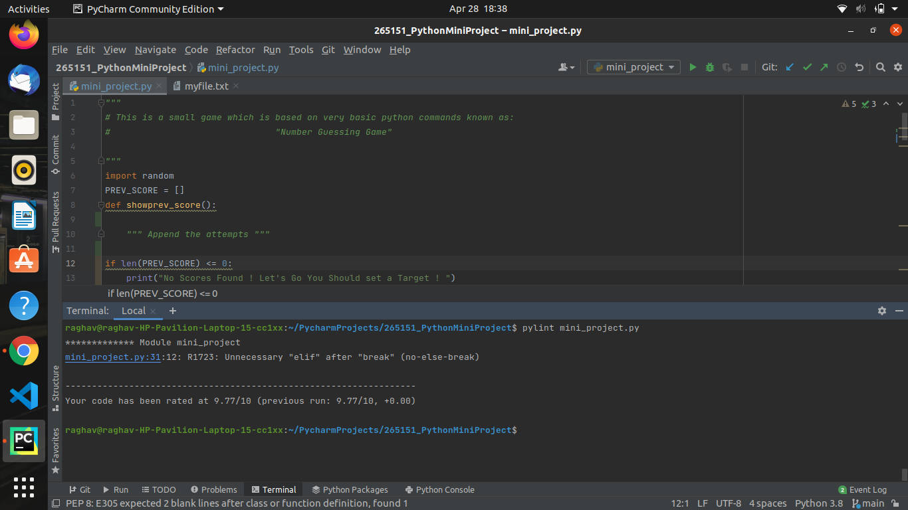

# 265151_PythonMiniProject
This is the Github Repository for Python Mini Project.

## Mandates
Task             | Status
-------------------| -----------------------------------------
`Usage of Functions`           | Implemented
`File I/O Functions`   | Implemented
`Static Code Analysis`         | Implemented
`GIT Submission` | Implemented

## Static Code Analysis
Items           | Description
-------------------| -----------------------------------------
`System`           | Ubuntu
`IDE`   | Pycharm
`Tool for Static Code Analysis`         | Pylint
`Result` | 9.77/10

## Screenshot for Static Code Analysis

