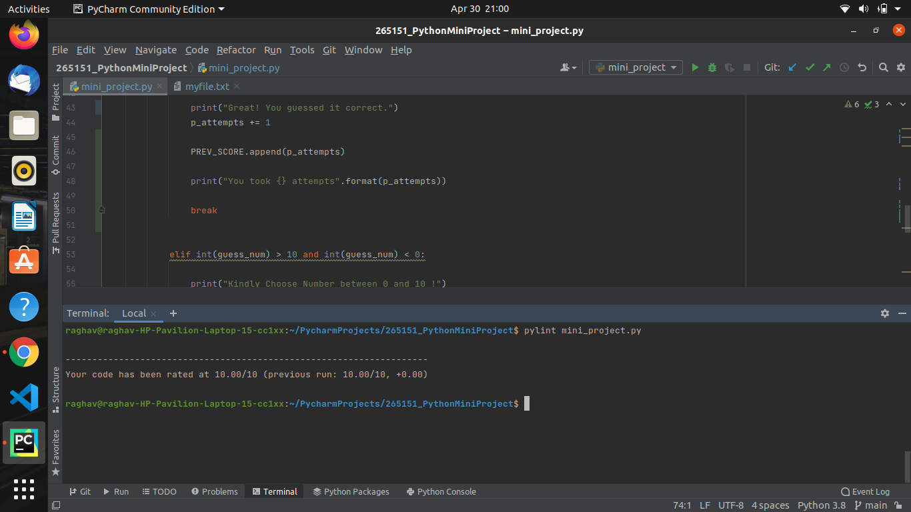

# 265151_PythonMiniProject
This is the Github Repository for Python Mini Project.

## Introduction
This Mini Project is basically a small game where the system generates a random number between 1 and 10 and the player has to guess that number . The program is designed as it count the attempts in which player has  guessed a number and give hints if player has not guessed the number in very first attempt. 

## Mandates
Task             | Status
-------------------| -----------------------------------------
`Usage of Functions`           | Implemented
`File I/O Functions`   | Implemented
`Static Code Analysis`         | Implemented
`GIT Submission` | Implemented

## Static Code Analysis
Items           | Description
-------------------| -----------------------------------------
`System`           | Ubuntu
`IDE`   | Pycharm
`Tool for Static Code Analysis`         | Pylint
`Result` | 10/10

## Screenshot for Static Code Analysis

